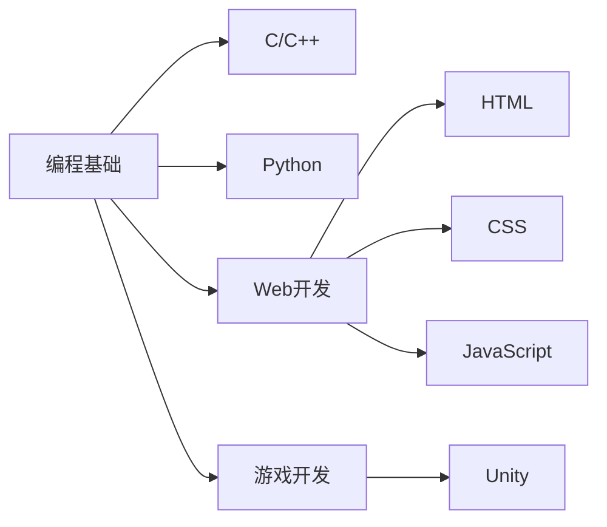

# 👋 你好

  

## 🎓 关于我
- 🧑‍🎓 学生 & 自学开发者
- 🚀 正在学习: C, C++, C#, Python, HTML, CSS, JavaScript, Unity, OpenGL
- 📚 学习方式: 79% 自学
- 🏷️ 个性签名: "自天佑之，吉无不利"

## 🌱 当前学习轨迹

## 🛠️ 技术栈
| 类别       | 技术                  | 掌握程度 |
|------------|-----------------------|----------|
| 编程语言   | C, C++, Python        | ⭐☆☆☆☆    |
| 前端       | HTML, CSS, JavaScript | ⭐☆☆☆☆    |
| 游戏开发   | Unity                 | ⭐⭐☆☆☆    |

## 📫 联系我
- 🙋‍♂️ 欢迎指教与交流！
- ✉️ 邮箱: reallearning0004@gmail.com
- 💬 座右铭: "学如拉玛，不拉则玛"
